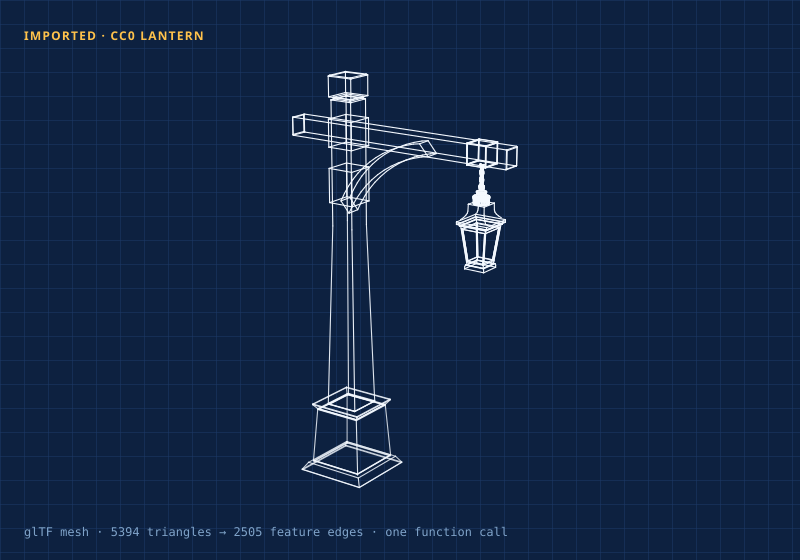

# linework

[](https://github.com/isaacrowntree/linework/actions)
[](LICENSE)
[](package.json)
[](https://isaacrowntree.com/linework/)

A tiny **true-3D renderer for annotated technical drawings**, output as plain SVG strings. Rotate → project → depth-sort → paint. Zero dependencies, ~180-line core, fully tested.

### ▶ [Try the live demo — drop a 3D model, watch it become a drawing](https://isaacrowntree.com/linework/)

[](https://isaacrowntree.com/linework/)

*The lantern above was **imported from a glTF mesh** and rendered by the library itself, in Node, with zero client JavaScript. On the [live demo](https://isaacrowntree.com/linework/) it orbits under your pointer — and you can drop your own model.*

## Why

The category is empty. WebGL libraries (three.js) make *shaded surfaces* easy and annotated linework painful — thin strokes, dash patterns, line-weight hierarchy, text callouts are all fights. Pseudo-3D toys (Zdog — last release 2019) can't do text or fine-grained depth sorting. Nothing ships "parametric technical illustration": exploded diagrams, dimension lines, balloons, title blocks. This does exactly that, and nothing else.

- **The classic pipeline, honestly implemented** — 3D points → yaw/pitch rotation → perspective projection → painter's-algorithm depth sorting *per frame* → SVG string. Paint order is computed, never authored.
- **Shapes built for drawings, not games** — multi-stroke paths (hollow-tube outlines as one shape), discs that project to correct ellipses, backface-culled boxes, per-object sorting for animated parts.
- **SVG strings are the point** — themeable with CSS variables, crawlable, printable, accessible, and **renderable server-side at build time**.
- **Styling is yours** — the library emits class names you define; it never dictates a look.

## The sketch layer — DX is a feature

Authoring should read like drafting, not like assembling tuples. Context blocks scope parts, tags and layering over everything drawn inside them:

```ts
import { sketch, scene } from "linework/sketch";

const s = sketch({ yaw: 0.5, pitch: 0.16, f: 1500, cx: 460, cy: 320 });

s.box(300, 380, 320, 42, 40, 80);                    // base plate

s.part("housing", 'class="prt"', () => {             // one <g>, one sort unit
  s.cyl([460, 218], 70, 34, -34, "ink");             // bearing body
  s.bias(0.6, () => s.cap([460, 218], 34, 32, "ink")); // bore, layered above
});

s.tube(9).M([180, 400]).Q([300, 420], 20, [420, 340], 10); // hollow frame tube

s.note("320 mm", [460, 452]);                        // paper-space annotation
el.innerHTML = s.render();                           // depth-sorted SVG
```

For animation, `scene()` gives you the frame-loop idiom — define once, replay with a new view per frame:

```ts
const draw = scene((s, { explode }) => { /* build with s.* */ });
el.innerHTML = draw({ yaw, pitch, f: 1500, cx: 460, cy: 320 }, { explode });
// ~1 ms for a few hundred shapes — drag-to-orbit rebuilds are free
```

Prefer bare metal? `linework` exports the raw `Shape` types + `render()`/`xform()`, and `linework/helpers` sits in between.

## Import a 3D model → a technical drawing

`linework/import` turns a **glTF/GLB or OBJ mesh into linework strokes**. A shaded model carries no lines — its form lives in where the surface bends — so it recovers exactly the lines a draftsperson would draw: the outline and the hard creases, nothing from the smooth interior of a face. The result drops straight into `render()` and rotates like any other scene.

*(That lantern in the header is exactly this: a CC0 glTF — 5,394 triangles of shaded mesh → 2,479 feature edges → rotatable line drawing, in one `meshToShapes()` call. [Drop your own .glb on the demo](https://isaacrowntree.com/linework/).)*

```ts
import { parseGLB, meshToShapes } from "linework/import";
import { render } from "linework";

const meshes = parseGLB(await file.arrayBuffer());          // or parseOBJ(text)
const shapes = meshToShapes(meshes, {
  angle: 25,                                                // crease threshold°
  fit: { cx: 400, cy: 300, size: 440 },                     // fit into a screen box
});
el.innerHTML = render(shapes, { yaw: 0.6, pitch: 0.35, f: 1400, cx: 400, cy: 300 });
```

`featureEdges(mesh)` is exposed on its own if you want the raw edge list. Vertices are welded by position first, so meshes that split a shared edge across primitives still sort as one surface. **No Draco**, and geometry-only — textures and materials are ignored. STEP/true-CAD import is on the roadmap.

## Coordinates (read this once)

| Field | Meaning |
|---|---|
| `x` | right, in your SVG's user units |
| `y` | **down** — screen convention, not math convention |
| `z` | toward the viewer; negative recedes and depth-dims |
| `view.yaw` | rotation about the vertical axis through `cx` (radians) |
| `view.pitch` | rotation about the horizontal axis through `cy`; positive looks down |
| `view.f` | perspective focal distance — `k = f/(f−z)`; larger = flatter |
| `bias` | per-shape depth nudge for deliberate coplanar layering |

**Paper space:** annotations (dimensions, balloons, title blocks) are strings appended *after* the sorted scene — they never rotate, exactly like a real drawing's notes. `sketch.pt(p, z)` projects model points so leaders can pin paper to model.

**Known limitation** (shared by every painter's-algorithm renderer): cyclic overlaps can't sort correctly — split long members into segments if you construct one.

## Server-side rendering

`render()` is a pure string function. Static site generators can emit finished 3D-looking diagrams with **zero client JS**:

```js
import { writeFileSync } from "node:fs";
writeFileSync("diagram.svg", wrapInSvgTag(render(shapes, view)));
```

The hero image above and this repo's [demo page](https://isaacrowntree.com/linework/) are both drawn this way — see [`scripts/render-hero.mjs`](scripts/render-hero.mjs) and [`docs/scene.js`](docs/scene.js).

## Install & test

```bash
npm i linework        # ESM, types included
npm test              # 19 tests: projection, parallax, paint order, culling,
                      # sketch scoping, and feature-edge extraction
```

## Contributing

Small, dependency-free, and test-driven on purpose — see [CONTRIBUTING.md](CONTRIBUTING.md). Changes are tracked in [CHANGELOG.md](CHANGELOG.md). Issues and PRs welcome.

## Provenance

Extracted from **Fitment** — a "will that part fit your bike?" planner whose exploded service-manual drawings are rendered entirely by this engine, live-orbitable, with dimension callouts in paper space over the rotating model.

## License

[MIT](LICENSE) © Isaac Rowntree
